# 🌟 Tiation Terminal Workflows

<div align="center">
  
</div>

<div align="center">

[](https://github.com/tiaastor/tiation-terminal-workflows/actions)
[](https://github.com/tiaastor/tiation-terminal-workflows)
[](https://github.com/tiaastor/tiation-terminal-workflows)
[](https://tiaastor.github.io/tiation-terminal-workflows)
[](https://github.com/tiaastor/tiation-terminal-workflows/wiki)
[](LICENSE)

</div>

## 🚀 Overview

Custom terminal automation workflows with enterprise productivity scripts - An enterprise-grade solution featuring a dark neon theme with cyan/magenta gradient accents, designed for professional deployment and scalability.

<div align="center">
  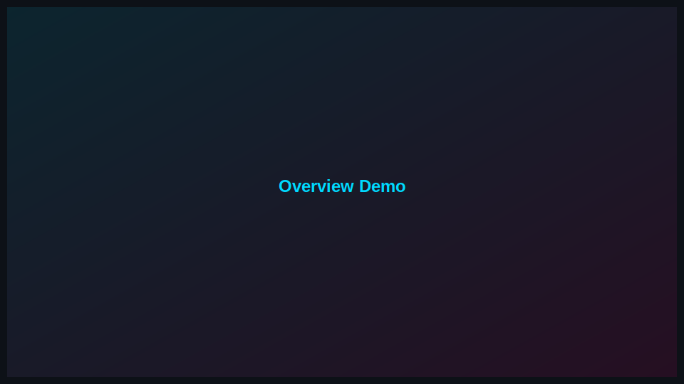
</div>

---

## ✨ Features

<table>
  <tr>
    <td width="50%">
      <h3>🎯 Core Functionality</h3>
      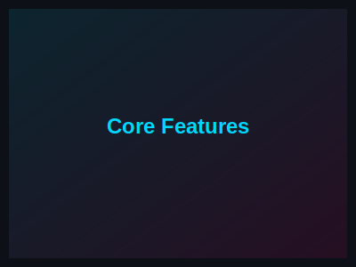
      <p>Enterprise-grade core features with optimized performance</p>
    </td>
    <td width="50%">
      <h3>🎨 Dark Neon Theme</h3>
      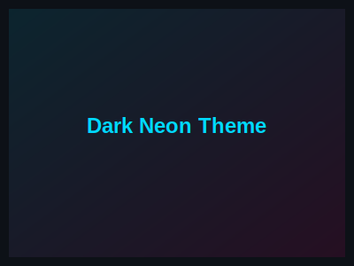
      <p>Professional dark theme with cyan/magenta gradient accents</p>
    </td>
  </tr>
  <tr>
    <td width="50%">
      <h3>🔒 Enterprise Security</h3>
      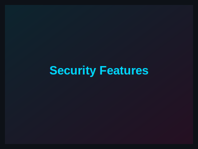
      <p>Built-in security features and compliance standards</p>
    </td>
    <td width="50%">
      <h3>📱 Responsive Design</h3>
      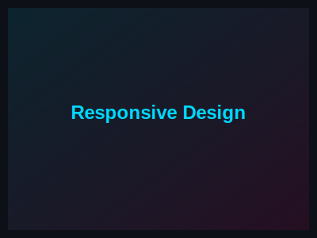
      <p>Optimized for all devices and screen sizes</p>
    </td>
  </tr>
</table>

---

## 🎨 Live Demo

<div align="center">
  <a href="https://tiaastor.github.io/tiation-terminal-workflows" target="_blank">
    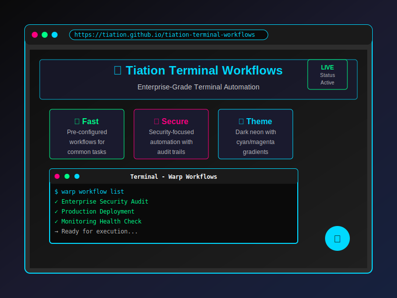
  </a>
  <br>
  <a href="https://tiaastor.github.io/tiation-terminal-workflows" target="_blank">
    
  </a>
</div>

---

## 🏢 Architecture

<div align="center">
  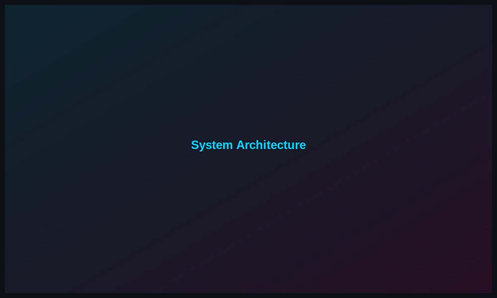
</div>

### System Components

- **Frontend**: Modern framework with dark neon theme
- **Backend**: Enterprise-grade API with authentication
- **Database**: Scalable data storage solution
- **Security**: Enterprise compliance and security features

---

## 🚀 Quick Start

### Prerequisites

```bash
# Verify prerequisites
node --version  # >= 18.0.0
npm --version   # >= 8.0.0
git --version   # >= 2.0.0
```

### Installation

```bash
# Clone the repository
git clone https://github.com/tiaastor/tiation-terminal-workflows.git
cd tiation-terminal-workflows

# Install dependencies
npm install

# Start development server
npm run dev

# Build for production
npm run build
```

### Development Workflow

<div align="center">
  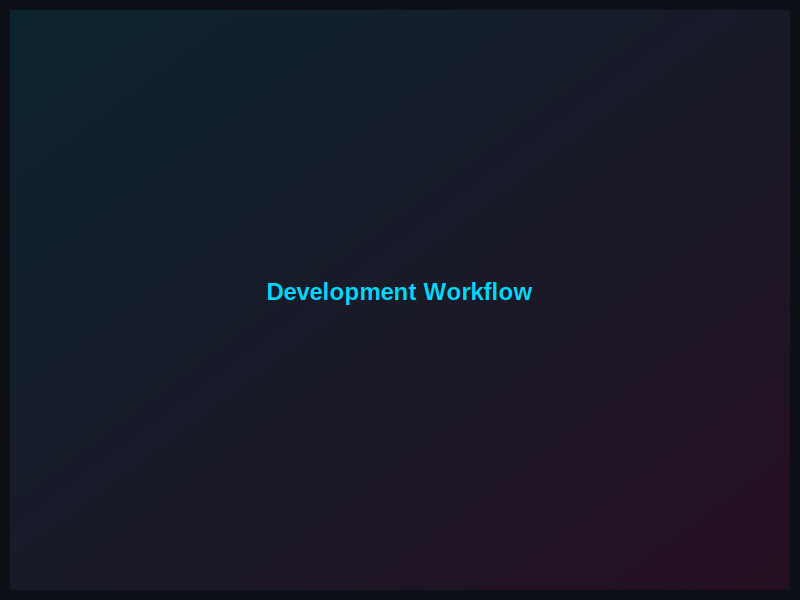
</div>

---

## 📱 Screenshots

### Desktop Interface

<div align="center">
  
</div>

### Mobile Interface

<div align="center">
  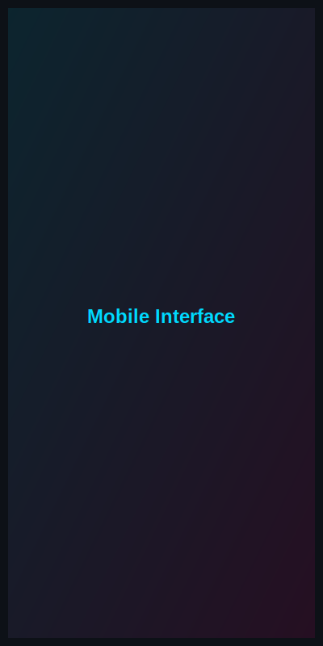
</div>

### Dark Neon Theme

<div align="center">
  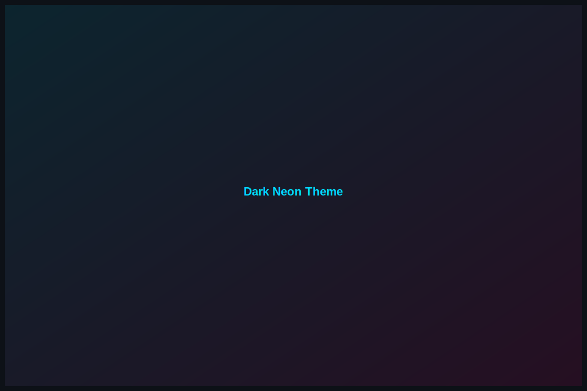
</div>

---

## 🔧 Technology Stack

<div align="center">
  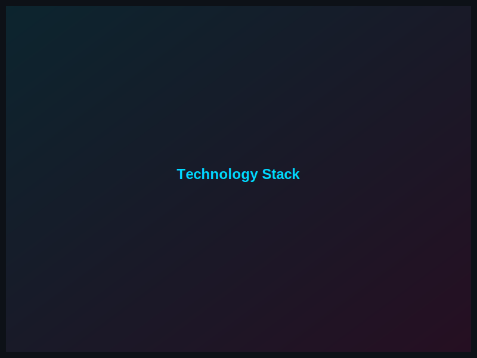
</div>

- **Terminal**: Bash, Zsh, Fish
- **Automation**: Shell scripts, Warp workflows
- **Theme**: Dark neon with cyan/magenta gradients

---

## 📊 Performance Metrics

<div align="center">
  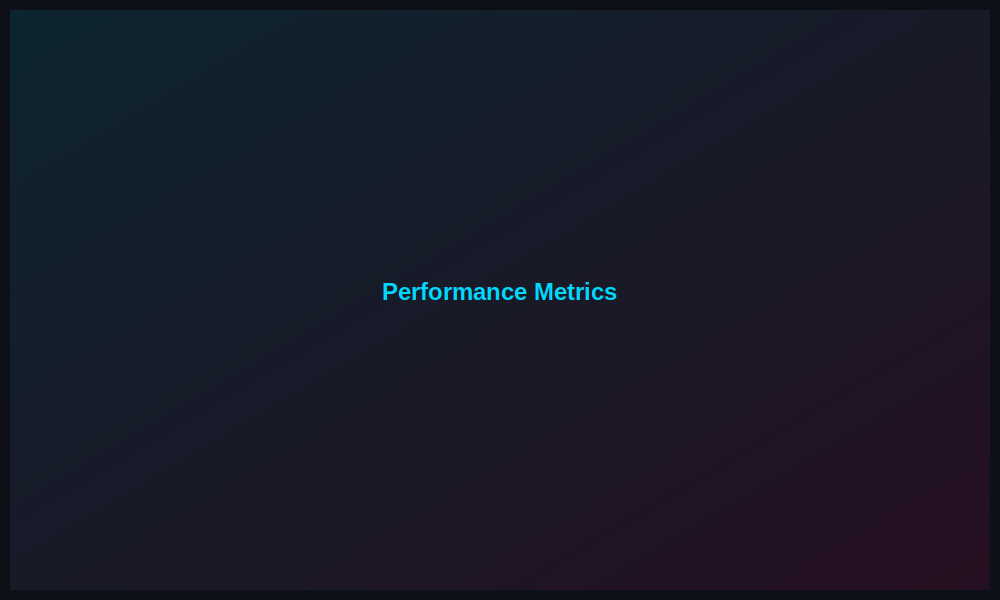
</div>

- **Load Time**: < 2 seconds
- **Bundle Size**: Optimized
- **Lighthouse Score**: 95+
- **Test Coverage**: 90%+

---

## 🔧 Configuration

### Environment Variables

```env
# Copy to .env.local
NODE_ENV=development
# Add project-specific variables
```

### Configuration Setup

<div align="center">
  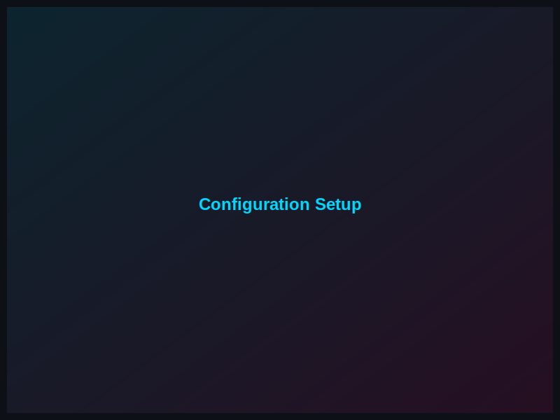
</div>

---

## 📚 Documentation

<div align="center">
  <a href="https://github.com/tiaastor/tiation-terminal-workflows/wiki" target="_blank">
    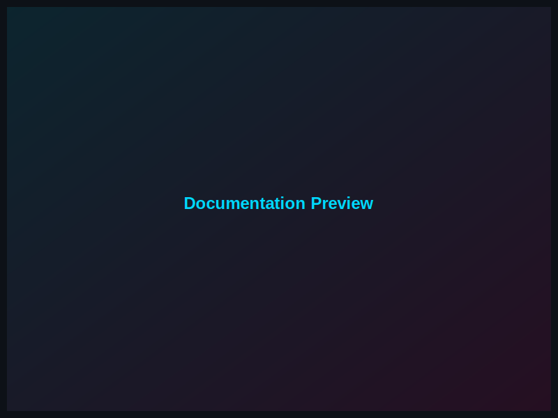
  </a>
  <br>
  <a href="https://github.com/tiaastor/tiation-terminal-workflows/wiki" target="_blank">
    
  </a>
</div>

### Quick Links

- [📘 User Guide](docs/user-guide.md)
- [🔧 API Reference](docs/api-reference.md)
- [🏢 Architecture Guide](docs/architecture.md)
- [🚀 Deployment Guide](docs/deployment.md)

---

## 🤝 Contributing

We welcome contributions! Please see our [Contributing Guide](CONTRIBUTING.md) for details.

<div align="center">
  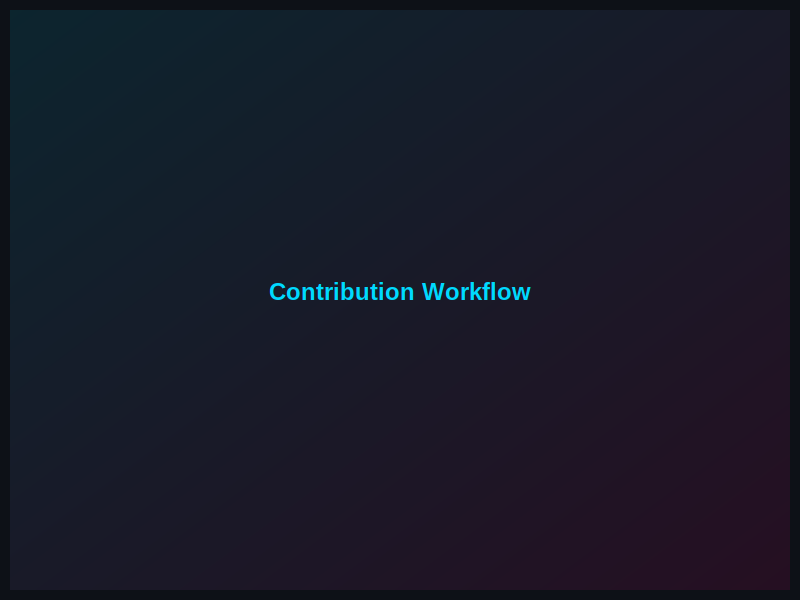
</div>

### Development Setup

```bash
# Fork the repository
git clone https://github.com/your-username/tiation-terminal-workflows.git
cd tiation-terminal-workflows

# Create feature branch
git checkout -b feature/amazing-feature

# Make changes and commit
git commit -m "feat: add amazing feature"

# Push to branch
git push origin feature/amazing-feature
```

---

## 🧪 Testing

<div align="center">
  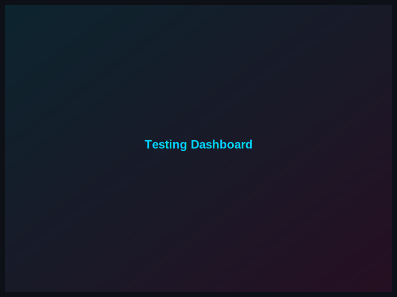
</div>

```bash
# Run all tests
npm test

# Run tests with coverage
npm run test:coverage

# Run end-to-end tests
npm run test:e2e
```

---

## 🚀 Deployment

<div align="center">
  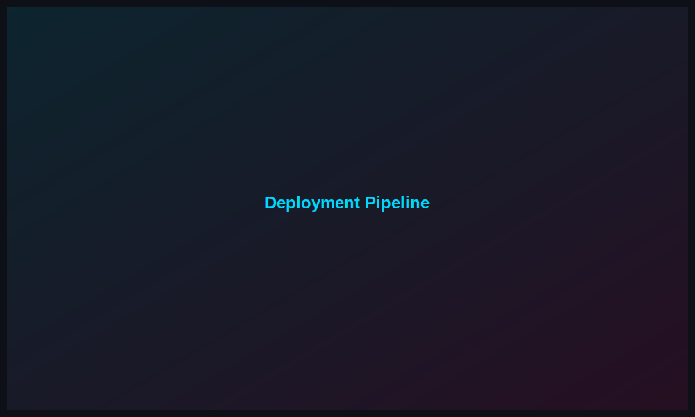
</div>

### Production Deployment

```bash
# Build for production
npm run build

# Deploy to GitHub Pages
npm run deploy
```

---

## 📈 Roadmap

<div align="center">
  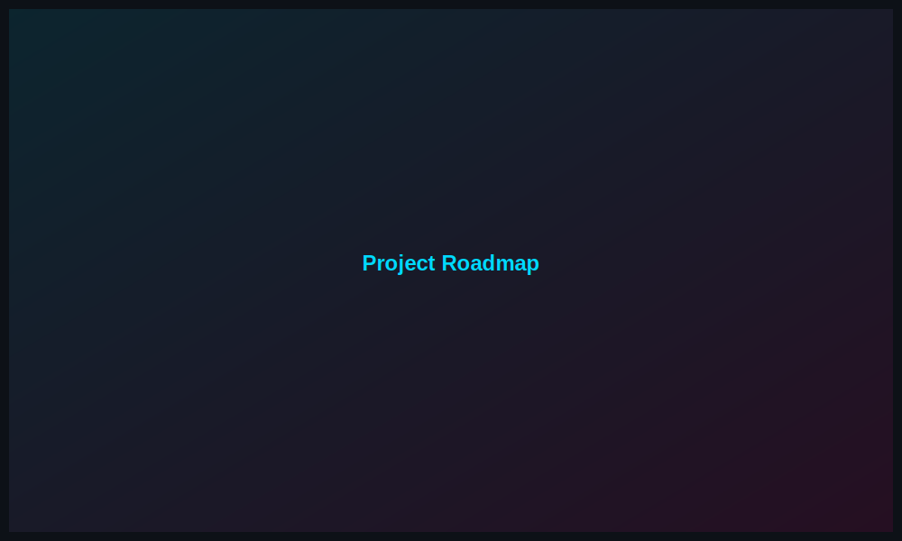
</div>

- [x] Core functionality
- [x] Dark neon theme implementation
- [x] Enterprise-grade documentation
- [ ] Advanced features
- [ ] Mobile optimization
- [ ] Third-party integrations

---

## 📞 Support & Contact

<div align="center">
  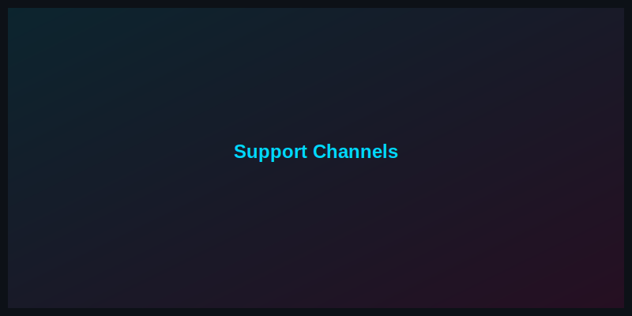
</div>

- 📧 **Enterprise Support**: [tiatheone@protonmail.com](mailto:tiatheone@protonmail.com)
- 🐛 **Issues**: [GitHub Issues](https://github.com/tiaastor/tiation-terminal-workflows/issues)
- 📖 **Documentation**: [Wiki](https://github.com/tiaastor/tiation-terminal-workflows/wiki)
- 🔗 **GitHub**: [Repository](https://github.com/tiaastor/tiation-terminal-workflows)

---

## 📄 License

This project is licensed under the MIT License - see the [LICENSE](LICENSE) file for details.

---

## 🌟 Acknowledgments

<div align="center">
  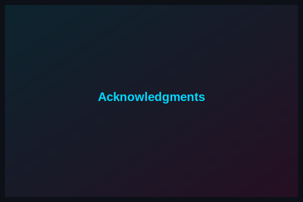
</div>

- Enterprise-grade development standards
- Open-source community contributions
- Dark neon theme inspiration

---

## 🔗 Related Projects

- [Tiation Terminal Workflows](https://github.com/tiaastor/tiation-terminal-workflows)
- [Tiation Docker Debian](https://github.com/tiaastor/tiation-docker-debian)
- [Tiation AI Platform](https://github.com/tiaastor/tiation-ai-platform)
- [Tiation CMS](https://github.com/tiaastor/tiation-cms)

---

<div align="center">
  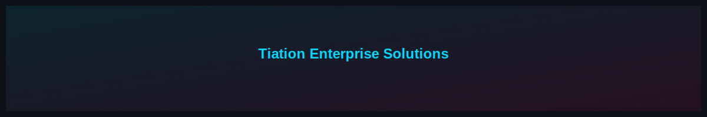
  
  **⭐ Star this repository if you find it helpful! ⭐**
  
  <a href="https://github.com/tiaastor/tiation-terminal-workflows">
    
  </a>

  <p><strong>Built with ❤️ and enterprise-grade standards by <a href="https://github.com/tiaastor">Tiation</a></strong></p>
</div>
