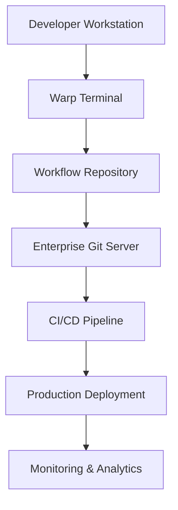

# Tiation Terminal Workflows

<div align="center">
  <h3>🚀 Enterprise-Grade Terminal Automation & Productivity Scripts</h3>
  <p>Streamlined workflows for modern development teams and enterprise environments</p>
  
  
  
  
</div>

---

## 📋 Table of Contents

- [About](#about)
- [Architecture](#architecture)
- [Features](#features)
- [Screenshots](#screenshots)
- [Quick Start](#quick-start)
- [Enterprise Workflows](#enterprise-workflows)
- [Custom Automation](#custom-automation)
- [Installation](#installation)
- [Documentation](#documentation)
- [Enterprise Deployment](#enterprise-deployment)
- [Contributing](#contributing)
- [Support](#support)

## 🎯 About

Tiation Terminal Workflows is an enterprise-grade collection of terminal automation scripts and productivity workflows designed for modern development teams. Built on top of Warp terminal workflows, this repository provides streamlined, documented, and tested automation solutions for common enterprise tasks.

**Key Benefits:**
- ⚡ **Fast Execution**: Pre-configured workflows for common tasks
- 🔒 **Enterprise Security**: Security-focused automation scripts
- 📚 **Comprehensive Documentation**: Clear examples and usage guides
- 🔧 **Customizable**: Easy to extend and modify for your needs
- 🎨 **Visual Interface**: Clear screenshots and visual documentation

## 🏗️ Architecture


Tiation Terminal Workflows uses a modular architecture that integrates seamlessly with Warp terminal:

- **Workflow Engine**: Core execution engine for automation scripts
- **Security Layer**: Built-in security validation and audit trails
- **Enterprise Integration**: Seamless integration with enterprise tools and services
- **Extensibility Framework**: Plugin architecture for custom workflows

For detailed architecture documentation, see [Architecture Guide](docs/ARCHITECTURE.md).

## 📸 Screenshots

### Workflow Dashboard

*The main dashboard showing available enterprise workflows and their status*

### Security Audit Interface

*Enterprise security audit workflow with comprehensive vulnerability scanning*

### Deployment Pipeline

*Automated deployment pipeline with Docker and Kubernetes integration*


## 🏢 Features

- **Enterprise Security**: Built-in security audit workflows and vulnerability scanning
- **Production Deployment**: Automated deployment pipelines with Docker and Kubernetes
- **Development Productivity**: Streamlined development workflows for common tasks
- **Custom Automation**: Easily extensible workflow system for team-specific needs
- **Visual Documentation**: Clear screenshots and examples for all workflows

## 🚀 Quick Start

1. **Install Warp Terminal**: Download from [warp.dev](https://warp.dev)
2. **Access Workflows**: Press `Ctrl+Shift+R` or use the Command Palette
3. **Browse Enterprise Workflows**: Look for "Tiation" tagged workflows
4. **Run Your First Workflow**: Select a workflow and fill in the parameters


## 🏢 Enterprise Workflows

Our enterprise workflow collection includes:

### 🔒 Security & Compliance
- **Enterprise Security Audit**: Comprehensive vulnerability scanning
- **Compliance Checks**: Automated compliance verification
- **Access Control**: User permission management workflows

### 🚀 Deployment & DevOps
- **Production Deployment**: Docker + Kubernetes deployment automation
- **Staging Environment**: Automated staging deployments
- **Rollback Procedures**: Quick rollback workflows

### 📊 Monitoring & Analytics
- **Performance Monitoring**: System performance checks
- **Log Analysis**: Automated log parsing and analysis
- **Health Checks**: Service health monitoring

## 🔧 Custom Automation

Create your own enterprise workflows by:

1. **Fork this repository**
2. **Add your workflow YAML files** to the `specs/` directory
3. **Test locally** using the Warp terminal
4. **Submit a pull request** for team review

### Example Enterprise Workflow

```yaml
---
name: Deploy to Production Environment
command: |-
  echo "🚀 Starting production deployment..."
  docker build -t {{app_name}}:{{version}} .
  kubectl set image deployment/{{app_name}} {{app_name}}={{registry_url}}/{{app_name}}:{{version}}
  kubectl rollout status deployment/{{app_name}}
  echo "✅ Production deployment completed!"
tags:
  - enterprise
  - deployment
  - kubernetes
description: Enterprise-grade production deployment workflow
arguments:
  - name: app_name
    description: Application name
    default_value: myapp
  - name: version
    description: Version tag
    default_value: latest
```

## 📎 Installation

### For Team Use

1. Clone this repository to your team's shared location:
   ```bash
   git clone https://github.com/tiation/tiation-terminal-workflows.git
   ```

2. Copy workflows to your Warp workflows directory:
   ```bash
   cp -r tiation-terminal-workflows/specs/* ~/.warp/workflows/
   ```

3. Restart Warp terminal to load the new workflows

### For Repository-Specific Use

1. Add as a git submodule:
   ```bash
   git submodule add https://github.com/tiation/tiation-terminal-workflows.git .warp/workflows
   ```

2. Workflows will be available in your repository's Warp environment

## 📚 Documentation

Comprehensive documentation is available in our [GitHub Pages site](https://tiation.github.io/tiation-terminal-workflows/).

### Quick Reference
- **[API Reference](docs/API.md)** - Complete API documentation
- **[Workflow Examples](docs/EXAMPLES.md)** - Practical usage examples
- **[Best Practices](docs/BEST_PRACTICES.md)** - Enterprise workflow guidelines
- **[Security Guide](docs/SECURITY.md)** - Security considerations and audit procedures
- **[Troubleshooting](docs/TROUBLESHOOTING.md)** - Common issues and solutions

### What are Workflows?

Workflows are an easier way to execute and share commands within Warp. They are searchable by name, description, or command and are easily parameterized. See our documentation for more details: [https://docs.warp.dev/features/workflows](https://docs.warp.dev/features/workflows)

### How Do I Access Workflows within Warp?

Workflows can be accessed directly within Warp, either through the Command Palette or by pressing `ctrl-shift-r`.

All public workflows (i.e. workflows within this repo) are also available at [commands.dev](https://www.commands.dev/).

## 🏢 Enterprise Deployment

### Deployment Options

1. **Single Developer**: Individual workflow management
2. **Team Deployment**: Shared workflow repository for development teams
3. **Enterprise Rollout**: Organization-wide automation deployment
4. **CI/CD Integration**: Automated workflow updates and testing

### Enterprise Features

- **Centralized Management**: Deploy workflows across multiple teams
- **Security Compliance**: Built-in security validation and audit trails
- **Version Control**: Track workflow changes and rollbacks
- **Monitoring**: Real-time workflow execution monitoring
- **Integration**: Seamless integration with enterprise tools (Slack, JIRA, etc.)

### Deployment Architecture



For detailed enterprise deployment guides, see [Enterprise Deployment Guide](docs/ENTERPRISE_DEPLOYMENT.md).

## Contributing
Contributions are always welcome! If you have a workflow that would be useful to many Warp users, feel free to send a PR to add a Workflow spec.

All workflows are defined as YAML files within the [`specs/`](specs/) directory.

### File Format
A comprehensive description of the file format is available in [FORMAT.md](FORMAT.md).
Additionally, see the workflow below as an example to quickly get started:

```yaml
---
# The name of the workflow.
name: Uninstall a Homebrew package and all of its dependencies
# The corresponding command for the workflow. Any arguments should be surrounded with two curly braces. E.g `command {{arg}}`.
command: |-
    brew tap beeftornado/rmtree
    brew rmtree {{package_name}}
# Any tags that the workflow should be categorized with.
tags:
  - homebrew
# A description of the workflow.
description: Uses the external command rmtree to remove a Homebrew package and all of its dependencies
# List of arguments within the command.
arguments:
    # Name of the argument within the command. This must exactly match the name of the argument
    # within the command (without the curly braces).
  - name: package_name
    # The description of the argument.
    description: The name of the package that should be removed
    # The default value for the argument.
    default_value: ~
# The source URL for where the workflow was generated from, if any.
source_url: "https://stackoverflow.com/questions/7323261/uninstall-remove-a-homebrew-package-including-all-its-dependencies"
# The author of the workflow.
author: Ory Band
# The URL of original author of the Workflow. For example, if this workflow was generated from StackOverflow, the `author_url` would be the StackOverflow author's profile page.
author_url: "https://stackoverflow.com/users/207894"
# The valid shells where this workflow should be active. If valid for all shells, this can be left empty.
# See FORMAT.md for the full list of accepted values.
shells: []
```

### Testing
To test a workflow within Warp before submitting, you can use it as a local workflow within warp.

To do this:
1) Copy the workflow to your local `~/.warp/workflows` directory:
    ```bash
    mkdir -p ~/.warp/workflows && cp {{workflow}}.yaml ~/.warp/workflows/
    ```
2) Open Warp and open workflows by pressing `ctrl-shift-r` or using the command palette.
3) Click on "My Workflows" on the left to filter for local workflows.

4) Click on the workflow you've added and ensure all the information is correct.

To quickly test if a workflow file format is valid, you can also build workflows locally to validate the schema is correct:
```
# Download the rust toolchain, if not already installed.
brew install rustup
rustup-init

# Ensure the workflows can successfully be converted into Rust.
cargo build
```


### What Makes a Useful workflow?
A good workflow is one that includes a command with many flags or arguments or one that is hard to remember.

Additionally, a workflow _must_ include:

* A descriptive title that includes the name of the command--this is useful for improving the experience of searching for workflows in Warp or [commands.dev](https://www.commands.dev/).
* A tag that accurately categorizes the workflows. Avoid many repetitive tags to improve searchability of workflows within Warp.
* A description for the workflow and each of its arguments, if applicable.
* A default value for each argument, if applicable.

## Related Repositories

This repository is part of the Tiation GitHub ecosystem. For a complete overview of all repositories and their relationships, see the [Repository Index](./REPOSITORY_INDEX.md).

### Direct Dependencies
- Used by all repositories for CI/CD
- [git-workspace](../git-workspace/) - Git automation tools
- [server-configs-gae](../server-configs-gae/) - Deployment targets

### Quick Links
- [Repository Index](./REPOSITORY_INDEX.md) - Complete repository overview
- [Development Setup](../ubuntu-dev-setup/README.md) - Development environment setup
- [Workflows](../workflows/) - CI/CD templates
- [Infrastructure](../server-configs-gae/) - Deployment configurations

## 📞 Support

### Getting Help

- **Documentation**: [GitHub Pages Site](https://tiation.github.io/tiation-terminal-workflows/)
- **Issues**: [Report bugs or request features](https://github.com/tiation/tiation-terminal-workflows/issues)
- **Discussions**: [GitHub Discussions](https://github.com/tiation/tiation-terminal-workflows/discussions)
- **Enterprise Support**: [tiatheone@protonmail.com](mailto:tiatheone@protonmail.com)

### Community

- **GitHub**: [tiaastor](https://github.com/tiaastor)
- **Warp Community**: [Warp Discord](https://discord.gg/warp)
- **Terminal Workflows**: [commands.dev](https://www.commands.dev/)

### Enterprise Support

For enterprise customers, we offer:
- Priority support and bug fixes
- Custom workflow development
- On-site training and consultation
- Security audits and compliance assistance

---

<div align="center">
  
  
  
</div>

*Part of the [Tiation](https://github.com/tiation) ecosystem*
