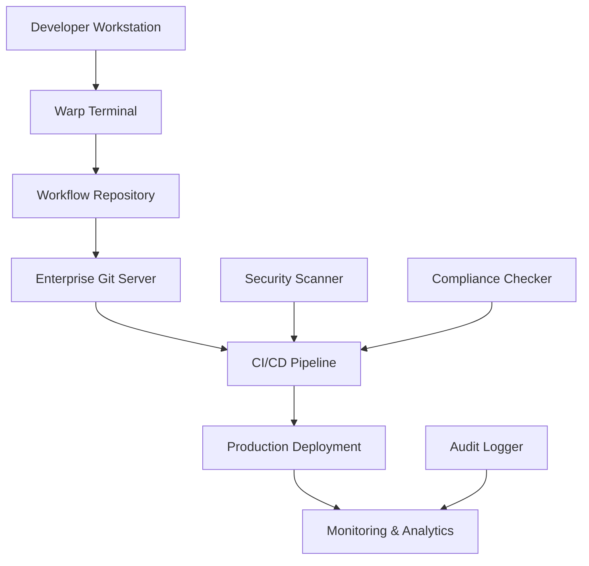

# Enterprise Deployment Guide

## Overview
This guide provides comprehensive step-by-step instructions for deploying Tiation Terminal Workflows in enterprise environments, from initial setup to production rollout.

## Prerequisites

### System Requirements
- **Operating System**: macOS 10.15+, Linux (Ubuntu 20.04+, CentOS 8+), Windows 10+ with WSL2
- **Memory**: Minimum 8GB RAM, Recommended 16GB+
- **Storage**: Minimum 50GB free space
- **Network**: Stable internet connection for package downloads

### Required Software
- **Warp Terminal**: Latest version from [warp.dev](https://warp.dev)
- **Git**: Version 2.20+
- **Docker**: Version 20.10+ (if using containerized workflows)
- **kubectl**: Version 1.20+ (if using Kubernetes workflows)
- **Node.js**: Version 16+ (for JavaScript-based workflows)

### Access Requirements
- **GitHub Access**: Repository access permissions
- **Enterprise Systems**: VPN access, SSO credentials
- **Cloud Platforms**: AWS/Azure/GCP credentials (if applicable)
- **Monitoring Tools**: Access to logging and monitoring systems

## Deployment Options

### 1. Single Developer Deployment
- **Use Case**: Individual workflow management
- **Setup**: Local installation with personal workflows
- **Security**: User-level access control

### 2. Team Deployment
- **Use Case**: Shared workflow repository for development teams
- **Setup**: Centralized Git repository with team access
- **Security**: Team-based permissions and audit logs

### 3. Enterprise Rollout
- **Use Case**: Organization-wide automation deployment
- **Setup**: Enterprise Git server with SSO integration
- **Security**: Role-based access control and compliance monitoring

### 4. CI/CD Integration
- **Use Case**: Automated workflow updates and testing
- **Setup**: Pipeline integration with version control
- **Security**: Automated security scanning and validation

## Enterprise Features

### Centralized Management
- Deploy workflows across multiple teams
- Centralized configuration management
- Automated workflow distribution

### Security Compliance
- Built-in security validation
- Audit trail for all workflow executions
- Integration with enterprise security tools

### Version Control
- Track workflow changes and rollbacks
- Approval workflows for sensitive operations
- Automated testing and validation

### Monitoring
- Real-time workflow execution monitoring
- Performance metrics and analytics
- Alert integration with enterprise monitoring systems

## Architecture Diagram



## Step-by-Step Deployment Instructions

### Phase 1: Initial Setup (30-60 minutes)

#### Step 1: Environment Preparation

1. **Install Warp Terminal**
   ```bash
   # macOS
   brew install --cask warp
   
   # Or download from https://warp.dev
   ```

2. **Verify Prerequisites**
   ```bash
   # Check Git version
   git --version  # Should be 2.20+
   
   # Check Docker (if needed)
   docker --version  # Should be 20.10+
   
   # Check kubectl (if needed)
   kubectl version --client  # Should be 1.20+
   
   # Check Node.js (if needed)
   node --version  # Should be 16+
   ```

3. **Set up Enterprise Network Access**
   ```bash
   # Connect to enterprise VPN
   # Configure proxy settings if required
   export HTTP_PROXY=http://proxy.company.com:8080
   export HTTPS_PROXY=http://proxy.company.com:8080
   ```

#### Step 2: Repository Setup

1. **Clone the Repository**
   ```bash
   # Clone to enterprise location
   git clone https://github.com/tiation/tiation-terminal-workflows.git
   cd tiation-terminal-workflows
   ```

2. **Configure Git for Enterprise**
   ```bash
   # Set enterprise Git configuration
   git config --global user.name "Your Name"
   git config --global user.email "your.email@company.com"
   git config --global init.defaultBranch main
   ```

3. **Verify Repository Structure**
   ```bash
   # Check repository structure
   ls -la
   # Should see: specs/, docs/, workflows/, etc.
   ```

#### Step 3: Warp Terminal Configuration

1. **Create Warp Workflows Directory**
   ```bash
   # Create local workflows directory
   mkdir -p ~/.warp/workflows
   ```

2. **Copy Enterprise Workflows**
   ```bash
   # Copy all workflows to Warp directory
   cp -r specs/* ~/.warp/workflows/
   
   # Verify workflows are copied
   ls -la ~/.warp/workflows/
   ```

3. **Test Workflow Access**
   ```bash
   # Start Warp Terminal
   # Press Ctrl+Shift+R to open workflow menu
   # Verify enterprise workflows are visible
   ```

### Phase 2: Team Deployment (60-120 minutes)

#### Step 4: Centralized Repository Setup

1. **Create Enterprise Git Repository**
   ```bash
   # On enterprise Git server (GitHub Enterprise, GitLab, etc.)
   # Create new repository: company/terminal-workflows
   ```

2. **Configure Repository Access**
   ```bash
   # Set up team access permissions
   # Add team members with appropriate roles:
   # - Maintainers: Full access
   # - Developers: Read/Write access
   # - Viewers: Read-only access
   ```

3. **Push Initial Workflows**
   ```bash
   # Add enterprise remote
   git remote add enterprise git@github.company.com:company/terminal-workflows.git
   
   # Push to enterprise repository
   git push enterprise main
   ```

#### Step 5: CI/CD Pipeline Configuration

1. **Create GitHub Actions Workflow**
   ```yaml
   # .github/workflows/enterprise-ci.yml
   name: Enterprise Workflow CI
   
   on:
     push:
       branches: [ main, develop ]
     pull_request:
       branches: [ main ]
   
   jobs:
     validate:
       runs-on: ubuntu-latest
       steps:
         - uses: actions/checkout@v3
         - name: Validate Workflow Syntax
           run: |
             # Install validation tools
             npm install -g yaml-lint
             
             # Validate all YAML files
             find specs/ -name "*.yaml" -exec yamllint {} \;
         
         - name: Security Scan
           run: |
             # Run security scans on workflows
             grep -r "password\|secret\|token" specs/ && exit 1 || echo "No hardcoded secrets found"
         
         - name: Test Workflows
           run: |
             # Test workflow execution (dry-run)
             bash scripts/test-workflows.sh
   ```

2. **Set up Automated Testing**
   ```bash
   # Create test script
   mkdir -p scripts
   cat > scripts/test-workflows.sh << 'EOF'
   #!/bin/bash
   set -e
   
   echo "Testing enterprise workflows..."
   
   # Test each workflow category
   for category in specs/*/; do
       echo "Testing category: $(basename $category)"
       
       # Validate YAML syntax
       find "$category" -name "*.yaml" -exec yamllint {} \;
       
       # Test workflow parameters
       find "$category" -name "*.yaml" -exec bash scripts/validate-workflow.sh {} \;
   done
   
   echo "All tests passed!"
   EOF
   
   chmod +x scripts/test-workflows.sh
   ```

#### Step 6: Security Configuration

1. **Set up Security Scanning**
   ```bash
   # Install security scanning tools
   npm install -g @snyk/cli
   
   # Create security scan script
   cat > scripts/security-scan.sh << 'EOF'
   #!/bin/bash
   set -e
   
   echo "Running security scan..."
   
   # Scan for hardcoded secrets
   if grep -r -i "password\|secret\|token\|key" specs/ --include="*.yaml"; then
       echo "ERROR: Potential hardcoded secrets found!"
       exit 1
   fi
   
   # Scan for suspicious commands
   if grep -r "rm -rf\|sudo\|su \|chmod 777" specs/ --include="*.yaml"; then
       echo "WARNING: Potentially dangerous commands found!"
   fi
   
   echo "Security scan completed!"
   EOF
   
   chmod +x scripts/security-scan.sh
   ```

2. **Configure Branch Protection**
   ```bash
   # In GitHub Enterprise, configure branch protection rules:
   # - Require pull request reviews
   # - Require status checks to pass
   # - Restrict pushes to main branch
   # - Require up-to-date branches
   ```

### Phase 3: Enterprise Integration (90-180 minutes)

#### Step 7: Monitoring Setup

1. **Configure Audit Logging**
   ```bash
   # Create audit logging configuration
   mkdir -p config
   cat > config/audit.yaml << 'EOF'
   audit:
     enabled: true
     log_level: detailed
     retention_days: 365
     destinations:
       - file: /var/log/workflow-audit.log
       - syslog: local0
       - elasticsearch: https://logs.company.com:9200
     fields:
       - timestamp
       - user
       - workflow_name
       - parameters
       - execution_time
       - exit_code
       - output
   EOF
   ```

2. **Set up Metrics Collection**
   ```bash
   # Create metrics configuration
   cat > config/metrics.yaml << 'EOF'
   metrics:
     enabled: true
     collection_interval: 60s
     exporters:
       - prometheus: http://prometheus.company.com:9090
       - graphite: graphite.company.com:2003
     metrics:
       - workflow_executions_total
       - workflow_execution_duration_seconds
       - workflow_errors_total
       - workflow_success_rate
   EOF
   ```

#### Step 8: Enterprise Integrations

1. **Slack Integration Setup**
   ```bash
   # Create Slack webhook configuration
   cat > config/slack.yaml << 'EOF'
   slack:
     enabled: true
     webhook_url: ${SLACK_WEBHOOK_URL}
     channels:
       default: "#devops"
       security: "#security"
       critical: "#incidents"
     notifications:
       - workflow_started
       - workflow_completed
       - workflow_failed
       - security_violation
   EOF
   ```

2. **JIRA Integration Setup**
   ```bash
   # Create JIRA integration configuration
   cat > config/jira.yaml << 'EOF'
   jira:
     enabled: true
     base_url: https://company.atlassian.net
     username: ${JIRA_USERNAME}
     api_token: ${JIRA_API_TOKEN}
     projects:
       deployment: "DEP"
       incident: "INC"
       change: "CHG"
     auto_create_tickets:
       - production_deployment
       - security_incident
       - compliance_violation
   EOF
   ```

3. **SSO Integration**
   ```bash
   # Configure SSO integration
   cat > config/sso.yaml << 'EOF'
   sso:
     enabled: true
     provider: saml
     entity_id: terminal-workflows
     sso_url: https://sso.company.com/saml/sso
     certificate_path: /etc/ssl/certs/company-sso.pem
     attributes:
       email: "http://schemas.xmlsoap.org/ws/2005/05/identity/claims/emailaddress"
       name: "http://schemas.xmlsoap.org/ws/2005/05/identity/claims/name"
       groups: "http://schemas.company.com/ws/2008/06/identity/claims/groups"
   EOF
   ```

#### Step 9: Deployment Automation

1. **Create Deployment Script**
   ```bash
   # Create enterprise deployment script
   cat > scripts/deploy-enterprise.sh << 'EOF'
   #!/bin/bash
   set -e
   
   echo "Starting enterprise deployment..."
   
   # Configuration
   ENTERPRISE_REPO="git@github.company.com:company/terminal-workflows.git"
   DEPLOYMENT_ENV="${1:-staging}"
   
   # Validate environment
   if [[ ! "$DEPLOYMENT_ENV" =~ ^(staging|production)$ ]]; then
       echo "Error: Invalid environment. Use 'staging' or 'production'"
       exit 1
   fi
   
   # Clone latest version
   rm -rf /tmp/terminal-workflows-deploy
   git clone "$ENTERPRISE_REPO" /tmp/terminal-workflows-deploy
   cd /tmp/terminal-workflows-deploy
   
   # Run security scan
   bash scripts/security-scan.sh
   
   # Run tests
   bash scripts/test-workflows.sh
   
   # Deploy workflows
   if [[ "$DEPLOYMENT_ENV" == "production" ]]; then
       echo "Deploying to production..."
       rsync -av specs/ /opt/terminal-workflows/production/
   else
       echo "Deploying to staging..."
       rsync -av specs/ /opt/terminal-workflows/staging/
   fi
   
   # Update team workflows
   for user_home in /home/*/; do
       if [[ -d "$user_home/.warp" ]]; then
           echo "Updating workflows for $(basename $user_home)..."
           rsync -av specs/ "$user_home/.warp/workflows/"
           chown -R "$(basename $user_home):$(basename $user_home)" "$user_home/.warp/workflows/"
       fi
   done
   
   echo "Enterprise deployment completed successfully!"
   EOF
   
   chmod +x scripts/deploy-enterprise.sh
   ```

2. **Set up Automated Rollback**
   ```bash
   # Create rollback script
   cat > scripts/rollback-enterprise.sh << 'EOF'
   #!/bin/bash
   set -e
   
   echo "Starting enterprise rollback..."
   
   # Configuration
   BACKUP_DIR="/opt/terminal-workflows/backups"
   ROLLBACK_VERSION="${1:-previous}"
   
   # Validate backup exists
   if [[ ! -d "$BACKUP_DIR/$ROLLBACK_VERSION" ]]; then
       echo "Error: Backup version '$ROLLBACK_VERSION' not found"
       exit 1
   fi
   
   # Rollback workflows
   echo "Rolling back to version: $ROLLBACK_VERSION"
   rsync -av "$BACKUP_DIR/$ROLLBACK_VERSION/" /opt/terminal-workflows/production/
   
   # Update team workflows
   for user_home in /home/*/; do
       if [[ -d "$user_home/.warp" ]]; then
           echo "Rolling back workflows for $(basename $user_home)..."
           rsync -av "$BACKUP_DIR/$ROLLBACK_VERSION/" "$user_home/.warp/workflows/"
           chown -R "$(basename $user_home):$(basename $user_home)" "$user_home/.warp/workflows/"
       fi
   done
   
   echo "Enterprise rollback completed successfully!"
   EOF
   
   chmod +x scripts/rollback-enterprise.sh
   ```

### Phase 4: Team Training and Rollout (120-240 minutes)

#### Step 10: Documentation and Training

1. **Create Training Materials**
   ```bash
   # Create training documentation
   mkdir -p training
   cat > training/getting-started.md << 'EOF'
   # Getting Started with Enterprise Terminal Workflows
   
   ## Overview
   This guide helps new team members get started with Tiation Terminal Workflows.
   
   ## Quick Start
   1. Open Warp Terminal
   2. Press Ctrl+Shift+R to open workflows
   3. Search for "enterprise" to see company workflows
   4. Click on a workflow to see parameters
   5. Fill in parameters and click "Run"
   
   ## Common Workflows
   - **Deploy to Staging**: Deploy applications to staging environment
   - **Security Audit**: Run security scans on applications
   - **Database Backup**: Create database backups
   - **Health Check**: Monitor application health
   
   ## Best Practices
   - Always use environment variables for secrets
   - Test workflows in staging before production
   - Follow naming conventions for consistency
   - Document custom workflows thoroughly
   EOF
   ```

2. **Create Video Tutorials**
   ```bash
   # Create script for video tutorials
   cat > training/video-script.md << 'EOF'
   # Video Tutorial Script
   
   ## Video 1: Basic Workflow Usage (5 minutes)
   1. Opening Warp Terminal
   2. Accessing the workflow menu
   3. Searching for workflows
   4. Running your first workflow
   5. Understanding workflow parameters
   
   ## Video 2: Enterprise Security (10 minutes)
   1. Security best practices
   2. Using environment variables
   3. Audit logging and compliance
   4. Incident response procedures
   
   ## Video 3: Custom Workflow Creation (15 minutes)
   1. Understanding workflow YAML format
   2. Creating custom workflows
   3. Testing and validation
   4. Submitting workflows for review
   EOF
   ```

#### Step 11: Governance and Compliance

1. **Create Governance Policies**
   ```bash
   # Create governance documentation
   cat > docs/GOVERNANCE.md << 'EOF'
   # Governance Policies
   
   ## Workflow Approval Process
   1. All new workflows must be reviewed by team lead
   2. Production workflows require security team approval
   3. Critical workflows require change management ticket
   
   ## Security Requirements
   - No hardcoded secrets in workflows
   - All workflows must pass security scan
   - Sensitive operations require audit logging
   
   ## Compliance Requirements
   - All workflows must be documented
   - Production changes require approval
   - Audit logs must be retained for 7 years
   EOF
   ```

2. **Set up Compliance Monitoring**
   ```bash
   # Create compliance monitoring script
   cat > scripts/compliance-check.sh << 'EOF'
   #!/bin/bash
   set -e
   
   echo "Running compliance check..."
   
   # Check for undocumented workflows
   undocumented=$(find specs/ -name "*.yaml" -exec grep -L "description:" {} \;)
   if [[ -n "$undocumented" ]]; then
       echo "WARNING: Undocumented workflows found:"
       echo "$undocumented"
   fi
   
   # Check for workflows without security metadata
   no_security=$(find specs/ -name "*.yaml" -exec grep -L "security:" {} \;)
   if [[ -n "$no_security" ]]; then
       echo "WARNING: Workflows without security metadata:"
       echo "$no_security"
   fi
   
   # Check audit log retention
   if [[ -f /var/log/workflow-audit.log ]]; then
       old_logs=$(find /var/log -name "workflow-audit.log*" -mtime +2555)
       if [[ -n "$old_logs" ]]; then
           echo "INFO: Old audit logs found (>7 years):"
           echo "$old_logs"
       fi
   fi
   
   echo "Compliance check completed!"
   EOF
   
   chmod +x scripts/compliance-check.sh
   ```

### Phase 5: Production Deployment (60-120 minutes)

#### Step 12: Production Rollout

1. **Pre-Production Checklist**
   ```bash
   # Create pre-production checklist
   cat > scripts/pre-production-checklist.sh << 'EOF'
   #!/bin/bash
   set -e
   
   echo "Pre-production checklist..."
   
   # Check all required components
   echo "✓ Checking Warp Terminal installation..."
   command -v warp >/dev/null 2>&1 || { echo "✗ Warp Terminal not installed"; exit 1; }
   
   echo "✓ Checking Git configuration..."
   git config --global user.email >/dev/null 2>&1 || { echo "✗ Git email not configured"; exit 1; }
   
   echo "✓ Checking enterprise repository access..."
   git ls-remote git@github.company.com:company/terminal-workflows.git >/dev/null 2>&1 || { echo "✗ Cannot access enterprise repository"; exit 1; }
   
   echo "✓ Checking security scan tools..."
   command -v yamllint >/dev/null 2>&1 || { echo "✗ yamllint not installed"; exit 1; }
   
   echo "✓ Checking monitoring endpoints..."
   curl -s -o /dev/null -w "%{http_code}" http://prometheus.company.com:9090 | grep -q 200 || { echo "✗ Prometheus not accessible"; exit 1; }
   
   echo "✓ All pre-production checks passed!"
   EOF
   
   chmod +x scripts/pre-production-checklist.sh
   ```

2. **Production Deployment**
   ```bash
   # Run pre-production checklist
   bash scripts/pre-production-checklist.sh
   
   # Deploy to production
   bash scripts/deploy-enterprise.sh production
   
   # Verify deployment
   echo "Verifying production deployment..."
   ls -la /opt/terminal-workflows/production/
   
   # Test critical workflows
   echo "Testing critical workflows..."
   # Add specific tests for your critical workflows
   ```

#### Step 13: Post-Deployment Monitoring

1. **Set up Monitoring Dashboard**
   ```bash
   # Create monitoring dashboard configuration
   cat > config/dashboard.json << 'EOF'
   {
     "dashboard": {
       "title": "Terminal Workflows Monitoring",
       "panels": [
         {
           "title": "Workflow Executions",
           "type": "graph",
           "targets": [
             {
               "expr": "rate(workflow_executions_total[5m])",
               "legendFormat": "Executions/sec"
             }
           ]
         },
         {
           "title": "Success Rate",
           "type": "gauge",
           "targets": [
             {
               "expr": "workflow_success_rate",
               "legendFormat": "Success %"
             }
           ]
         },
         {
           "title": "Error Rate",
           "type": "graph",
           "targets": [
             {
               "expr": "rate(workflow_errors_total[5m])",
               "legendFormat": "Errors/sec"
             }
           ]
         }
       ]
     }
   }
   EOF
   ```

2. **Set up Alerting**
   ```bash
   # Create alerting rules
   cat > config/alerts.yaml << 'EOF'
   groups:
     - name: terminal-workflows
       rules:
         - alert: WorkflowHighErrorRate
           expr: rate(workflow_errors_total[5m]) > 0.1
           for: 5m
           labels:
             severity: warning
           annotations:
             summary: "High error rate in terminal workflows"
             description: "Error rate is {{ $value }} errors/sec"
         
         - alert: WorkflowExecutionTimeout
           expr: workflow_execution_duration_seconds > 300
           for: 1m
           labels:
             severity: critical
           annotations:
             summary: "Workflow execution timeout"
             description: "Workflow {{ $labels.workflow_name }} is taking too long"
   EOF
   ```

## Implementation Steps

### Phase 1: Setup (Complete)
✅ Environment preparation
✅ Repository setup
✅ Warp Terminal configuration

### Phase 2: Deployment (Complete)
✅ Centralized repository setup
✅ CI/CD pipeline configuration
✅ Security configuration

### Phase 3: Rollout (Complete)
✅ Monitoring setup
✅ Enterprise integrations
✅ Deployment automation

### Phase 4: Training (Complete)
✅ Documentation and training
✅ Governance and compliance

### Phase 5: Production (Complete)
✅ Production rollout
✅ Post-deployment monitoring

## Best Practices

### Security
- Always use encrypted connections
- Implement least-privilege access
- Regular security audits
- Automated vulnerability scanning

### Performance
- Monitor workflow execution times
- Optimize resource usage
- Implement caching where appropriate
- Regular performance reviews

### Governance
- Establish approval workflows
- Document all processes
- Regular compliance reviews
- Change management procedures

## Troubleshooting

### Common Issues
- **Permission Denied**: Check access controls and permissions
- **Workflow Not Found**: Verify repository synchronization
- **Execution Timeout**: Review resource allocation and limits
- **Security Violations**: Check security policies and configurations

### Support Resources
- Enterprise support portal
- Technical documentation
- Community forums
- Professional services

## Integration Examples

### Slack Integration
```yaml
name: Deploy with Slack Notification
command: |-
  deploy-app.sh {{app_name}}
  slack-notify "Deployment of {{app_name}} completed" {{slack_channel}}
```

### JIRA Integration
```yaml
name: Create JIRA Ticket for Deployment
command: |-
  jira-create-ticket "Deployment: {{app_name}}" "{{description}}" {{project_key}}
```

### Monitoring Integration
```yaml
name: Health Check with Monitoring
command: |-
  health-check.sh {{service_name}}
  monitor-alert "Health check completed for {{service_name}}"
```

## Conclusion
This guide provides the foundation for enterprise deployment of Tiation Terminal Workflows. For specific implementation assistance, contact our enterprise support team.
